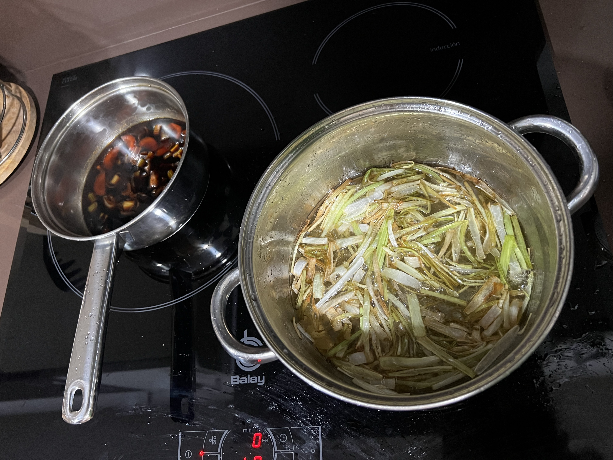
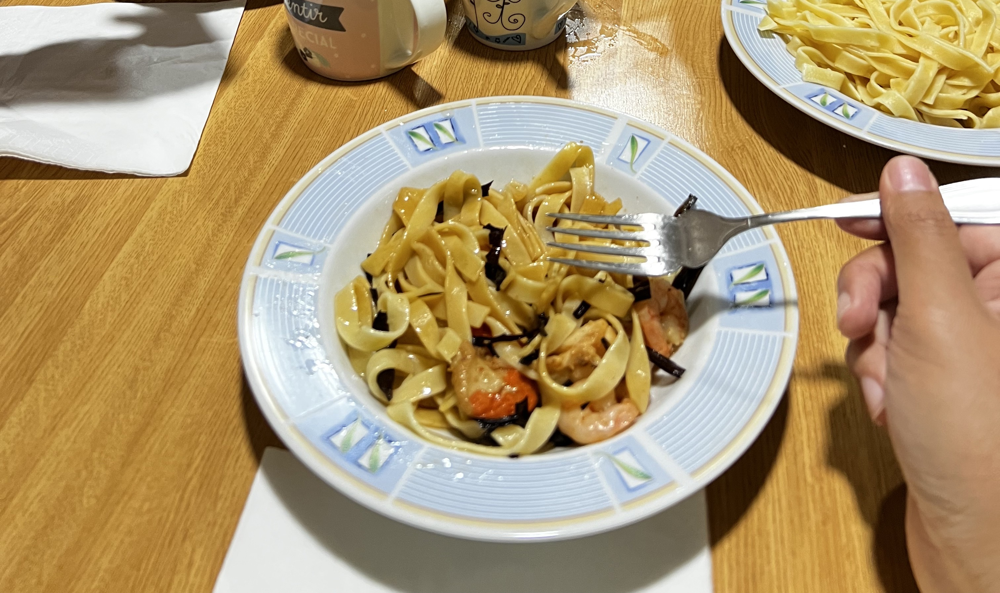
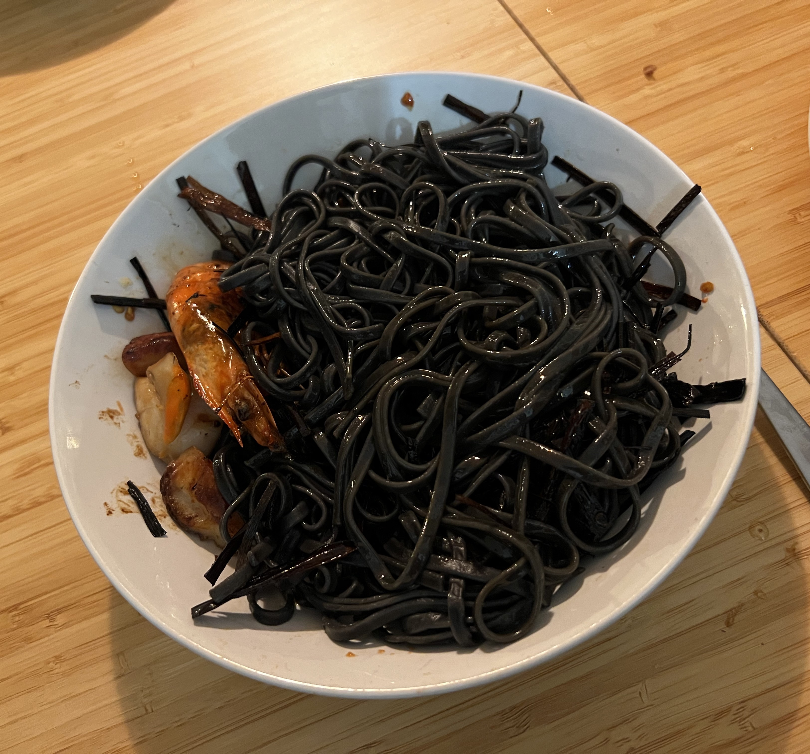

# Seafood pasta with scallions( 开洋葱油拌面 )
This pasta is a traditional Chinese dish I made in my Camino de Santiago, and there are some adjustmants because some of the ingredients is not easy to buy in Europe. 
Here I will provide the Camino version one, but also introduce the difference between the authentic Chinese version.
This Seafood pasta with scallions is basically a pasta mixed with fried scallions oil and soy bean sauce, in China, it's a local dish which is popular in the east area especially in Shnaghai. And in Shanghai, we called it 葱油拌面(pronounce as cong you ban mian) or 开洋葱油拌面(pronounce as kai yang cong you ban mian), 开洋(pronounce as kai yang) here means dried shrimps, which is a way how Chinese keep the seafood: sun dried them for long term storage. and also it will provide a more compressed flavor in the food.
And in Camino de Santiago, I made this pasta many times for these reasons: the quality of seafood in Spain is great, and this dish you can always control the cost so you can feed many people with this dish, and also for some people based on the vegetarian diet, you can also feed them with the no seafood version.

## Ingredients
* **Pasta**
Choose the Tagliatelle, Pappardelle, Fettuccine or Linguine, the key is we want the thick body of the pasta to hold more oil and sauces at the last step when you mix the dish, which provide us a better taste.
If you want a interesting version of this dish, try to find the squid ink pasta in the supermarket, and you will have a dish very like Linguine al nero di seppia but taste same with the Chinese dish, which is really funny.
If you want the authentic version, find a Chinese supermarket and ask them for 碱水面(pronounce as jian shui mian) or 碱水挂面(pronounce as jian shui gua mian)
* **Scallions**
Choose the scallions and it is the best option, or shallots, or at least leek. You can also go to Chinese food supermarket to find 葱(pronounce as cong) or 小葱(pronounce as xiao cong) which is Chinese way to say scallions.
* **Oil**
Choose the sunflower oil, peanut oil or canola oil, don't choose olive oil because we fry the scallions, and olive oil has low smoke temperature point.
* **Soy bean sauce**
Best option is to go to the Chinese food supermarket to find 酱油(pronounce as jiang you) or 生抽(pronounce as sheng chou) at a lower price, and they are actually kind of the same thing, and in normal supermarket you can find the Japanese soy bean sauce which is also good but more expensive.
* Carrots
We don't need lots of carrots, it's for the making flavored soy bean sauce and you won't find carrots in the pasta.
* Onions
We don't need lots of onions, it's for the making flavored soy bean sauce and you won't find onions in the pasta.
* Celery
We don't need lots of celery, it's for the making flavored soy bean sauce and you won't find celery in the pasta.
* Sugar
* *Shrimps/Prawns*
This is optional, especially for vegetarian diet version. Choose the fresh tiger prawns or freezed prawns in the supermarket, and don't use the pre cooked/boiled prawn. and we don't need very big prawn, find the ones at around your index finger's length will just be perfect.
In the authentic Chinese version, people don't use the fresh Prawns and use dried shrimps instead, but you can have the fresh prawns for a better flavor and look also for luxuray too.
* *Scallops*
This is optional, especially for vegetarian diet version. Choose the fresh scallops or freezed scallops in the supermarket.
* *Dried Shrimps*
This is super optional, it's for the making flavored soy bean sauce and you won't find dried shrimps in the pasta. It is called 虾皮(pronounce as xia pi) in Chinese and you can(or maybe can only) find it in Chinese food supermarket. **You can really skip this if you already have the fresh shrimps or prawns**.

## Cooking Steps
### Making the scallions oil and the fried scallions
Cut the scallions, to make the scallions oil and the fried scallions, we use some white parts of the scallions and also some green part of the scallions. We cut the scallions into around at around 3cm length and for each section, we peel the scallions flat and then cut them into around 3cm * 2mm sizes. then we put some oil(not too less and not too much, like 100ml, depend on the size of the pan, we have to fry the scallions just like making french fries) in the pan, put the scallions slices in and heat the oil, fry the scallions slices into a **more brown less green or white condition**, and stop the fire, fish out the fried scallions slices into one bowl, and pour out the oil into another bowl. And we can have the scallions oil and the fried scallions.

### Making the fried seafoods(skip this step if you are making a vegetarian diet version)
When you pour out the oil from the last step, leave some of the oil to make sure the bottom of the pan is with oil, then we use the pan to fry the seafoods. If you have the scallops, we fry the scallops first. Wash the scallops first and cut each scallops into half if you think it is too big for one bite, dry them with kitchen paper, and heat up the pan again, when the pan is hot, we put the scallops inside and fry them, the perfect fried scallops is when they are in a golden brown color, and the crust on the scallops tastes sweet. Then pour out the fried scallops into another bowl. And then the shrimp, if you have peeled shrimps from the fridge, you just fry them into the a well done condition. If you have fresh prawns, you can peel the prawns, remove the prawn threads and leave the head of the prawns because it can provide the falvor, then fry the prawns into a well done condition. pour the shrimps/prawns out into a bowl for later use.

### Making the flavored soy bean sauce
The last step when we fry the seafood, we will leave some of the crust in the pan and we use this pan to make the flavored soy bean sauce. Chop a carrot and celery and onion into dice or little pieces, Put them in the pan and then pour 100ml of water into the pan, then we pour out 200ml of soy bean sauce into the pan and we add some sugar(like 10g or 15g), if you have dried shrimps, you can put some of them into the pan as well, but if you don't it is still good because the crust will provide the seafood flavor. We boil the soy bean sauce for 15 minutes and we filter out the vegetables and the dried shrimps(we won't use them again) in the liquid, and we pour only liquid of flavored soy bean sauce into a bowl. 

Fry the scallions and making the flavored soy bean sauce

### Boil the pasta and the final steps
Heat up a pot, and boil the pasta(here you don't need salt in the water to boil the pasta), when the pasta is ready, prepare a deep plate, add one large tea spoon of scallions oil at the bottom, one large tea spoon of flavored soy bean sauce in the bottom, 200g of pasta, and mix the pasta, then put some fried scallions on the top, if you have fried seafoods, add the amount of fried seafoods as you want on the pasta and Voilà(you can also have your guest mix the pasta themselves).

Finish of the pasta

the Linguine al nero di seppia version of the pasta

